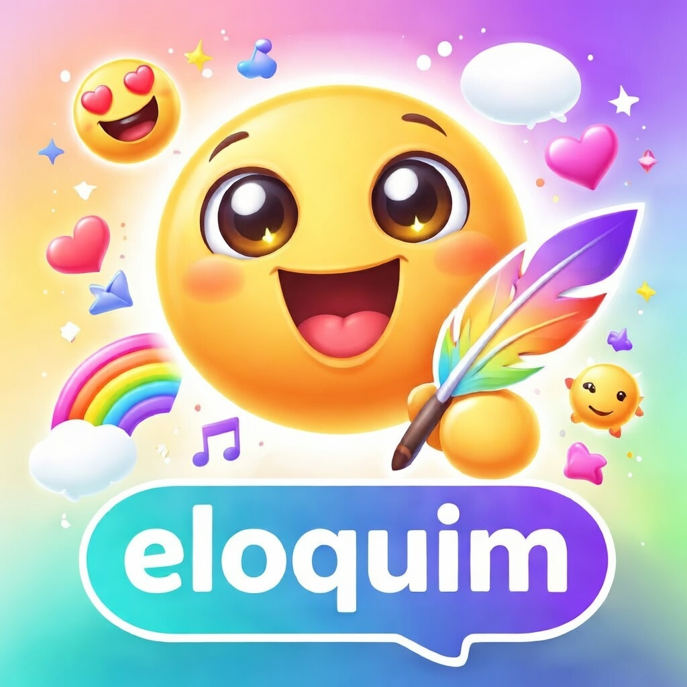

  

## About

Eloquim transforms emoji into expressive, personality-driven communication through AI-powered translation, creating a universal language that bridges hearts and minds through modern hieroglyphics.

You can try it out here:
https://eloquim.serverpod.space/app
